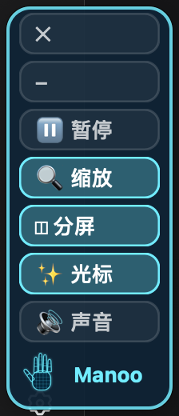
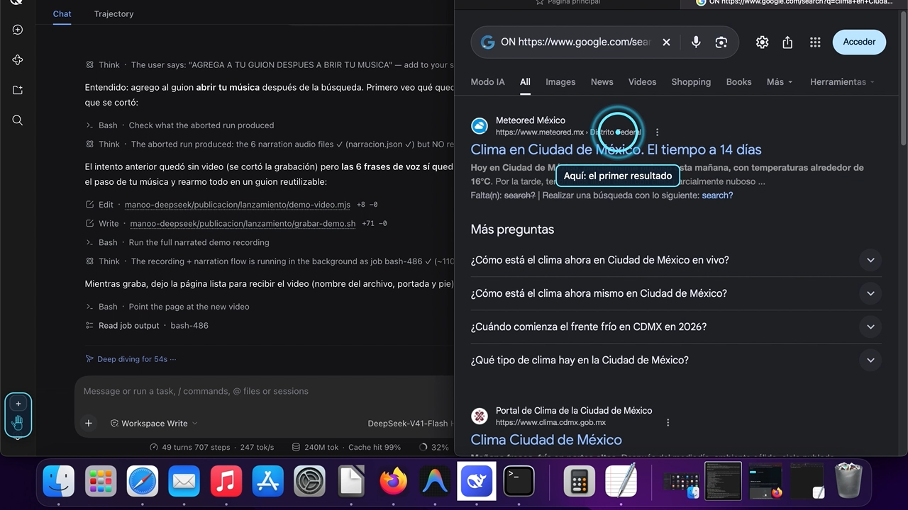

# Manoo · 给 DeepSeek Harness 的双手

**Manoo 给 DeepSeek 一双手**：它能看你的屏幕、移动鼠标、替你打字。
你像吩咐一个人那样吩咐它——「打开浏览器查一下天气」「教我在哪里点保存」——
它就当着你的面做，屏幕上有**状态栏**、有**指路的圆环**、还有**声音**一步步念给你听。

它是为**不太会用电脑的人**做的，说**西班牙语、英语和中文**，
目标是你用完这一回**学到了东西**，而不是只拿到一个自己做不出来的结果。





---

## 这个仓库是什么（以及不是什么）

这里**只有连接器**：它告诉 DeepSeek Harness 如何通过官方桥接
`@deepseek-ai/dsh-mcp-client` 和 Manoo 说话。**它不包含 Manoo 程序本身。**

程序在 **https://manoo-deepseek.corporacionjamiel.workers.dev/** 单独下载
（每次会话 **免费 25 步操作**；Pro 不限量）。装在 Mac 上之后，这个连接器把它接到 harness 里。

## 安装（两步）

**1. 安装连接器**——在 harness 的插件市场里装，或者手动：

```bash
dsh plugin --profile web add manoo-manos
```

**2. 下载 Manoo 并告诉它在哪里**

从 https://manoo-deepseek.corporacionjamiel.workers.dev/ 下载，把压缩包解到你的个人文件夹，
命名成 `manoo`，然后运行：

```bash
node instalar.mjs
```

它会把你的 Manoo 路径写进连接器。之后**重启 DeepSeek Harness** 就能用了。
如果 Manoo 装在别的地方：

```bash
MANOO_HOME=/你的/manoo node instalar.mjs
```

## 怎么用

把你想做的事写出来，就像跟人说话一样：

- **「帮我填这个表」** → 常规步骤 Manoo 自己做，只把属于你的留给你：
  密码、以及付款或签名的那一下。
- **「教我在哪里点保存」** → 它什么都不碰：用**圆环**指给你看，等你动手。
- **「你来做」** → 常规步骤不再问你。

用状态栏上的 🔊 打开声音，它会**念出每一步**；按 ✕ 收起状态栏；
按 ⏸ **Manoo 什么都不碰**，直到你取消。

## macOS 需要的权限

| 权限 | 用来做什么 |
|---|---|
| **辅助功能** | 移动鼠标、打字、读取按钮名字 |
| **屏幕录制** | 需要截图时看屏幕 |
| **输入监控** | **紧急停止**：你一碰鼠标或键盘，Manoo 就停下 |

没有第三个，紧急停止不工作——安装时会检查并告诉你。

## Manoo 不做的事（写在代码里，不是写在说明里）

- **绝不输入**密码、PIN、卡号或验证码。
- **绝不按最后一个按钮**：付款、转账、签名、发布——它指给你，你自己按。
- **不进**银行、投资、加密货币、密码管理器和税务相关的应用——不打开也不看。
- **你一碰鼠标或键盘，它立刻停下**并问你要不要继续。
- 第一次碰到某个应用时会**先问你**，圆环指在「允许」上。

## 隐私（说明白）

Manoo 跑在你的电脑上，**不给我们自己的服务器发任何东西**。
Manoo 看到的内容（屏幕上的文字和截图）会送到 **DeepSeek 的 API**，
由它处理并**保存在中国**。许可和收款由商店处理，完整说明见
https://manoo-deepseek.corporacionjamiel.workers.dev/privacidad.html

## 支持范围

目前**只有 macOS**。Windows 和 Linux 在 Claude 那个版本的项目里。

## 许可

连接器免费，可以原样分享；**Manoo 程序是分开的**，有自己的许可和价格。见 [LICENSE](LICENSE)。

## 声明

Manoo 是 **Corporación Jamiel** 的独立产品。**与 DeepSeek AI 和 Anthropic 都没有隶属关系**：
「DeepSeek」和「Claude」是各自所有者的商标，这里只用来说明它能和什么一起用。

作者 **Jamiel García Velázquez** · © 2026
